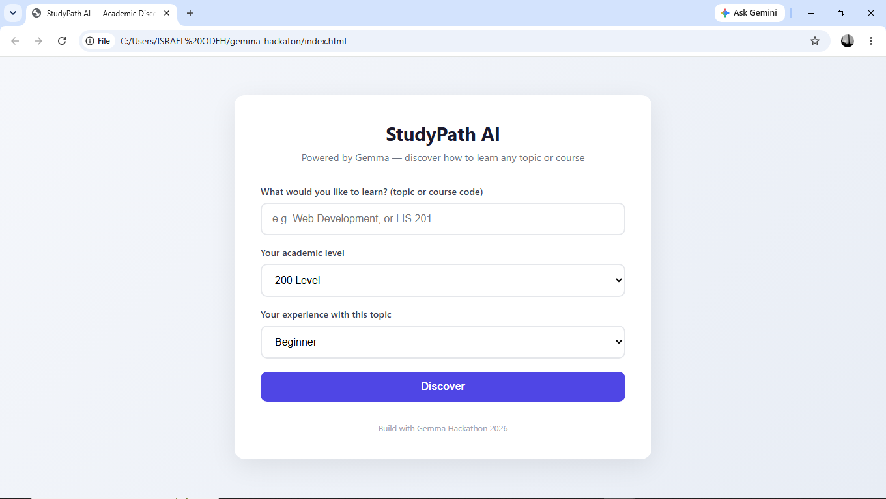
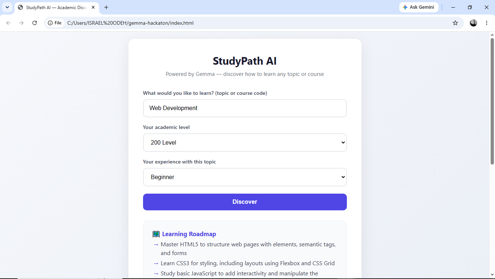
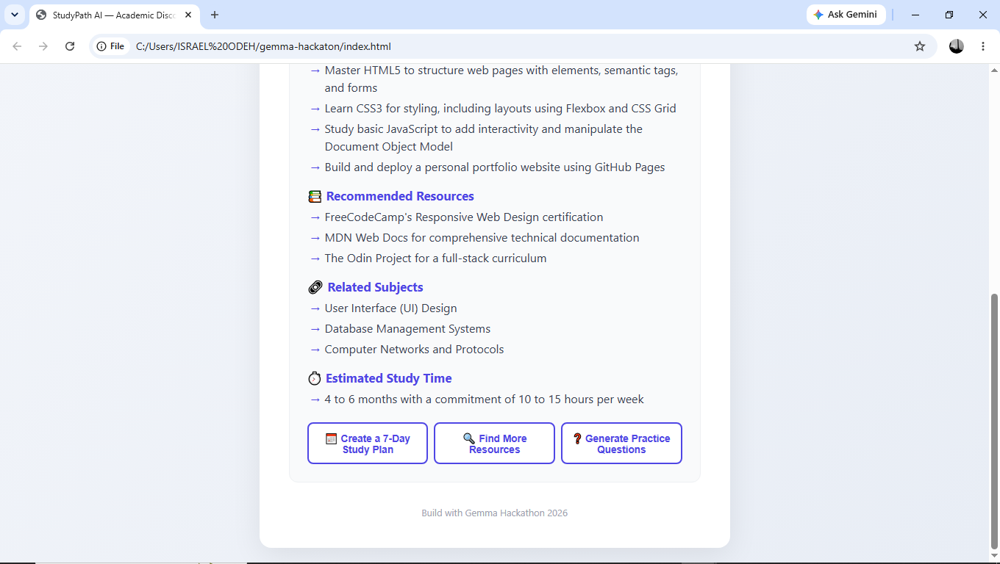
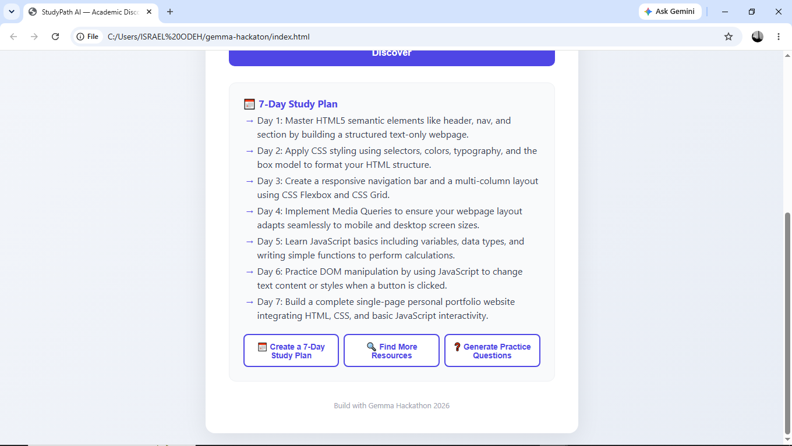

# StudyPath AI 🎓

An AI-powered academic assistant that helps university students discover how to learn a new topic or navigate a specific course — built for **Build with Gemma** (GDG on Campus FUTMinna).

---

## 🧠 The Problem

Many university students struggle to turn curiosity into a clear learning path.

Whether preparing for a course, learning a new skill, or exploring an unfamiliar subject, students often face information overload, scattered resources, and uncertainty about what to study first. As a result, learning becomes inefficient, frustrating, and heavily dependent on trial and error.

---

## 💡 The Solution

**StudyPath AI** is a Gemma-powered assistant that takes a topic or course code as input and returns:

- 🗺️ **Learning Roadmap** — a step-by-step progression tailored to the student's experience level
- 📚 **Recommended Resources** — practical learning materials and trusted sources
- 🔗 **Related Subjects** — topics worth exploring next
- ⏱️ **Estimated Study Time** — a realistic estimate of the time required to gain competence

Students also specify:

- Academic Level (100–500 Level)
- Experience Level (Beginner, Intermediate, or Advanced)

This allows StudyPath AI to provide guidance that better matches the learner's background.

After the initial response, students can continue learning through:

- 📅 **7-Day Study Plan Generation**
- 🔍 **Additional Learning Resources**
- ❓ **Practice Question Generation**

---

## 🎓 Example Use Case

**Input:** `Web Development`

**Academic Level:** `200 Level`

**Experience Level:** `Beginner`

**Output:**

- A structured roadmap (HTML → CSS → JavaScript → Frameworks → Backend Development)
- Recommended learning resources
- Related subjects worth exploring
- Estimated study timeline
- A personalized 7-day study plan
- Practice questions for self-assessment

---

## 🎯 Why This Matters

As a Library and Information Science student, I have personally experienced the challenge of trying to learn new subjects outside the classroom.

While teaching myself web development, preparing for university courses, and exploring new fields, I often found myself overwhelmed by scattered resources and unsure where to start.

Many students face the same problem. We often have access to information, but not a clear pathway through it.

Libraries have always helped people discover, organize, and access knowledge. StudyPath AI applies that same principle using Gemma—helping students transform information overload into a structured learning path tailored to their needs.

This project targets the **AI for Social Impact** track by helping students discover, organize, and act on educational information more effectively.

---

## 🤖 Gemma Integration

StudyPath AI is built around Gemma as its core reasoning engine.

Every learning roadmap, resource recommendation, study plan, practice question, and study-time estimate is generated dynamically by Gemma based on the student's input, academic level, and experience level.

Gemma is responsible for:

- Understanding student learning requests
- Adapting responses to different experience levels
- Generating personalized learning roadmaps
- Recommending learning resources
- Suggesting related subjects
- Creating study plans
- Generating practice questions
- Estimating learning timelines

The application's core functionality depends on Gemma-generated responses rather than predefined templates.

**Model Used:** `gemma-4-26b-a4b-it` via the Gemini API (Google AI Studio)

### Course Input Note

For course code or course-title inputs, Gemma is prompted to distinguish between general learning topics and course-related inputs and adapt its guidance accordingly.

StudyPath AI does not rely on a university syllabus database. Responses are intended as learning guidance and study support rather than official course outlines.

---

## 📸 Screenshots

### Home Screen


### Topic Input & Personalization


### Generated Learning Roadmap


### Interactive Follow-Up: 7-Day Study Plan


---

## 🎥 Demo Video

See the project demo video for a complete walkthrough of the application's functionality.

[Insert Demo Video Link]

---

## 🚀 How to Run Locally

1. Clone the repository

```bash
git clone https://github.com/izzywebtech/studypath-ai.git
cd studypath-ai
```

2. Get a free API key from Google AI Studio.

3. Open `script.js` and add your API key:

```javascript
const GEMMA_API_KEY = 'YOUR_API_KEY_HERE';
```

4. Open `index.html` in your browser.

No build tools, frameworks, or backend setup required.

---

## 🛠️ Tech Stack

- HTML
- CSS
- Vanilla JavaScript
- Gemma 4 (`gemma-4-26b-a4b-it`)
- Gemini API (Google AI Studio)
- Fully Client-Side Architecture

---

## 📋 Features

- ✅ Topic input
- ✅ Course code/title input
- ✅ Academic-level personalization
- ✅ Experience-level personalization
- ✅ AI-generated learning roadmaps
- ✅ Resource recommendations
- ✅ Related subject discovery
- ✅ Estimated study-time guidance
- ✅ 7-Day Study Plan generation
- ✅ Practice Question generation
- ✅ Responsive user interface

---

## 🔮 Future Work

- Conversational learning assistant with memory
- Resource reliability scoring
- Visual knowledge maps
- Enhanced academic metadata support
- Support for secondary school students and independent learners
- Progress tracking and learning history

---

## 👤 Author

**Israel Odeh**

Library and Information Science Student

Federal University of Technology Minna (FUT Minna)

Developed for **Build with Gemma** (GDG on Campus FUTMinna).

---

## 📄 License

This project was created for the Build with Gemma Hackathon and is shared for educational and portfolio purposes.